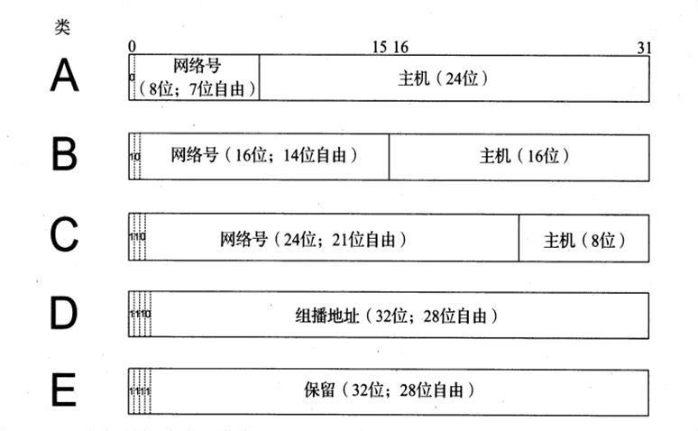

# Internet地址结构

## IP地址

**IP地址**：Internet中使用的网络层地址。

> **注意：**
>
> 链接到Internet的每个设备至少有一个IP地址。基于TCP/IP协议的专用网络中使用的设备也需要IP地址。
> 
> 对于全球性的Internet地址，一个分层结构管理实体帮助用户和服务提供商分配地址。个人用户通常由`Internet服务提供商（ISP）`分配地址。

### 表示IP地址

#### IPv4地址

**点分四组表示法（点分十进制表示法）：**

由四个用点分隔的十进制数组成。每个数都是一个非负整数，范围是[0-255]，代表整个IP地址的四分之一。

例如：`165.195.130.107`。

每个用点分四组表示法表示的IPv4地址都会对应一个二进制结构，如下：

| 点分四组表示 | 二进制表示 |
|:---:|:---:|
| 0.0.0.0 | 00000000 00000000 00000000 00000000 |
| 1.2.3.4 | 00000001 00000010 00000011 00000100 |
| 10.0.0.255 | 00001010 00000000 00000000 11111111 |
| 165.195.130.107 | 10100101 11000011 10000010 01101011 |
| 255.255.255.255 | 11111111 11111111 11111111 11111111 |

#### IPv6地址

地址长度是128位，是IPv4地址长度的4倍。

传统表示方法是：块（字段）的四个十六进制数（因为十六进制转换为二进制更容易），这些数由冒号分隔。

> **注意：** a-f的十六进制数字应该用小写表示。（[[RFC5952]](http://www.ietf.org/rfc/rfc5952.txt)）

例如，一个包含8个块的IPv6地址：`5f05:2000:80ad:5800:0058:0800:2023:1d71`。

**IPv6地址简化表示法（[[RFC4291]](http://www.ietf.org/rfc/rfc4291.txt)）：**

1. 一个块中前导的零不必书写（必须压缩（[[RFC5952]](http://www.ietf.org/rfc/rfc5952.txt)））。前面的例子可以写为：`5f05:2000:80ad:5800:58:800:2023:1d71`
2. 全零的块可以省略，并用符号`::`代替，但是一个IPv6地址中`::`只能出现一次，并且`::`只能用于影响最大的地方，用于压缩最多的0。如果有多个块中包含等长度的零，顺序靠前的块将被替换为`::`([[RFC5952]](http://www.ietf.org/rfc/rfc5952.txt))。例如，`0:0:0:0:0:0:0:1`可以写为`::1`；`2001:0db8:0:0:0:0:0:2`可以写为`2001:db8::2`；`0:0:1:0:0:204:8da:0`可以写为`::1:0:0:201:8da:0`。
3. 在IPv6格式中嵌入IPv4地址可使用混合符号形式，紧接着Ipv4部分的地址块的值为`ffff`，地址的其余部分使用点分四组格式。例如，IPv6地址`::ffff:10.0.0.1`可以表示Ipv4地址`10.0.0.1`。被称为**IPv4映射的IPv6地址**。
4. ~~（本条已经被废弃[[RFC4291]](http://www.ietf.org/rfc/rfc4291.txt)）IPv6的低32位（即后两个数块）通常采用点分四组表示法，被称为**IPv4兼容的IPv6地址**。即IPv6地址`::102:f001`相当于`::1.2.240.1`。~~

下表展示了一些IPv6地址使用不同简化表示法，与其对应的二进制表示的例子：

| 十六进制表示 | 二进制表示 |
|:---:|:---:|
| 5f05:2000:80ad:5800:58:800:2023:1d71 | 0101111100000101 0010000000000000 1000000010101101 0101100000000000 0000000001011000 0000100000000000 0010000000100011 0001110101110001 |
| ::1 | 0000000000000000 0000000000000000 0000000000000000 0000000000000000 0000000000000000 0000000000000000 0000000000000000 0000000000000001 |
| ::1.2.240.1 或 ::102:f001 | 0000000000000000 0000000000000000 0000000000000000 0000000000000000 0000000000000000 0000000000000000 0000000100000010 1111000000000001 |

在某些情况下，IPv6地址中的冒号分隔符可能与其他分隔符混淆，例如IP地址和端口号之间使用的冒号。这时要用括号字符`[`和`]`包围IPv6地址。例如：

`http://[2001:0db8:85a3:08d3:1319:8ae2:0370:7344]:443/`

是指IPv6主机`2001:db8:85a3:8d3:1319:8ae2:370:7344`中的端口号`443`使用`HTTP`、`TCP`和`IPv6`协议。

### IP地址结构

IPv4地址空间中有 4 294 967 296 个可能的地址。
IPv6地址空间中有 340 282 366 920 938 463 463 374 607 431 768 211 456 个可能的地址。

**单播地址：** 大多数IPv4地址块（多个连续的地址）最终被细分为一个地址，用于识别连接Internet或某些专用的内连网的计算机网络接口。这些地址称为**单播地址** 

#### 分类寻址

每个单播IP地址都有一个*网络*部分（网络号）和一个*主机*地址部分（主机号）。

* 网络号：用于识别接口使用的IP地址在哪个网络中可被发现。
* 主机号：用于识别由网络部分给出的网络中的特定主机。

IP地址空间划分分为五大类，类由地址中的头几位来定义：首位为`0`是A类，前两位为`10`是B类，前三位为`110`是C类，以此类推。每类都基于网络中可容纳的主机数量（当前或预计的主机数量），确定在一个32位的IPv4地址中分配给网络号和主机号的位数。如下图所示：

其中A、B、C类用于为Internet（单播地址）中的借口分配地址，以及其它一些特殊情况下使用；D类地址供组播使用；E类地址保留。

下表是分类寻址的IPv4地址空间划分：

| 类 | 地址范围 | 高序位 | 用途 | 百分比 | 网络数 | 主机数 |
|:---:|:---:|:---:|:---:|:---:|:---:|:---:|
| A | 0.0.0.0 ~ 127.255.255.255 | 0 | 单播/特殊 | 1/2 | 128 | 16 777 216 |
| B | 128.0.0.0 ~ 191.255.255.255 | 10 | 单播/特殊 | 1/4 | 16 384 | 65 536 |
| C | 192.0.0.0 ~ 223.255.255.255 | 110 | 单播/特殊 | 1/8 | 2 097 152 | 256 |
| D | 224.0.0.0 ~ 239.255.255.255 | 1110 | 组播 | 1/16 | N/A | N/A |
| E | 240.0.0.0 ~ 255.255.255.255 | 1111 | 保留 | 1/16 | N/A | N/A |

使用方法可以参考：如某个站点分配了一个A类网络号`18.0.0.0`（MIT），其中有224个地址分配给主机（即IPv4地址使用范围为`18.0.0.0 ~ 18.255.255.255`），但在整个Internet中只有127个A类网络。再比如，某个站点分配了一个C类网络号`192.125.3.0`，只能容纳256台主机（即IPv4地址使用范围为`192.125.3.0 ~ 192.125.3.255`），但是有超过200万的C类网络号是可用的。

> **注意：** 上面对可用网络数量和主机数量的统计是不准确的。有些地址通常不作为单播地址使用。特别是地址块中的第一个和最后一个地址通常不使用。在上面A类网络号的例子中，站点分配的地址块是`18.0.0.0`，其中`18.0.0.0`和`18.255.255.255`通常是不使用的，即实际能分配的单播IP地址数量是 224 - 2 = 16 777 214 个。

分类寻址的分配方式非常不方便，A类和B类网络号通常浪费大量的主机号，而C类网络号不能提供足够的主机数量。